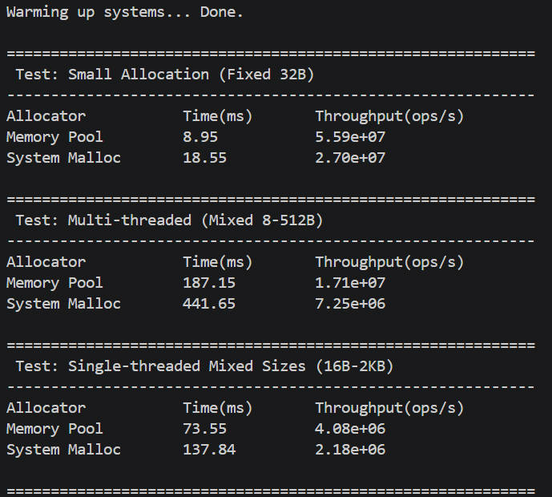

# XMemoryPool 

一个基于 **C++11** 实现的高性能、高并发内存分配器，采用经典的 **TCMalloc 三级缓存架构**，并在底层引入 **基数树 (Radix Tree)** 极速映射逻辑。

## 核心架构

1. **ThreadCache**: 线程本地缓存。每个线程独享，分配内存时 **无需加锁**，是极速分配的核心。对于超过 256KB 的大对象，直接调用系统 `malloc`/`free`。
2. **CentralCache**: 中心缓存。通过 **128路分段桶锁** 机制减少竞争，负责向 ThreadCache 提供批量内存块。
3. **PageCache**: 页级别管理。负责与系统交互 (`mmap`)，并支持 **Span 内存合并** 以减少外部碎片。

---

## 技术亮点

### 1. 基数树 (Radix Tree) 极速映射
本项目在 `PageCache` 层引入了 **四级基数树** 替代传统的 `std::map`：
* **O(1) 查询**: 4层结构，每层13位，共支持52位页号映射，实现 `PageID -> Span*` 的极速定位，查询开销不随内存规模增长。

### 2. 锁脱钩与高并发优化
* **128路分段锁**: CentralCache 采用 128 个互斥锁分段管理，并使用 `alignas(64)` 消除 伪共享 (False Sharing) 导致的缓存一致性风暴。

* **锁脱钩技术**: CentralCache 在向 PageCache 申请内存前释放桶锁，在锁外完成耗时的 Span 切分操作，确保高并发下的极致稳定性，杜绝了阻塞蔓延。

* **TLS (Thread Local Storage)**: 完美实现线程隔离，确保 ThreadCache 的零竞争访问。

### 3. 自适应慢启动（Slow Start）
* **动态策略**: 引入类似 TCP 的慢启动机制，ThreadCache 根据每次 cache miss 动态增加批量获取的大小（`maxSize`），首次 miss +4 块，后续逐步增长。

* **智能归还**: ThreadCache 采用 **4倍阈值** 判断是否归还内存给 CentralCache，大幅减少跨线程内存流动，降低缓存抖动。

* **负载均衡**: 自动适应混合场景下的分配模式，有效降低了内存频繁在二三级缓存间搬运（Thrashing）带来的抖动。

### 4. 智能 Span 合并策略
* 利用基数树 O(1) 查询能力轻松获取相邻页面的 `Span` 状态。

* 在 `dealloc` 时自动触发向前、向后合并，将碎片化的页重新组合成大块连续内存，提升内存利用率。

---

## 性能基准 (Benchmark)

以下是在 32 线程高并发压力下运行10次的平均测试结果（数据源自 perf_test.cpp）：

最后一次测试截图：


平均测试数据：

|测试项目 | Memory Pool (平均耗时)|系统 Malloc (平均耗时)|性能提升 (%)|
|---|---|---|---|
|小对象分配 (32B)|9.68 ms|17.35 ms|+44.2%|
|多线程并发 (32 线程)|197.92 ms|392.70 ms|+49.6%|
|混合尺寸分配 (10W 次)|62.10 ms|128.80 ms|+51.8%|

> 注：多线程测试结果受 CPU 核心数、锁竞争影响较大。实际性能取决于硬件环境和工作负载模式。

---

## 构建与运行

### 环境要求
* CMake 3.10+
* C++11 编译器 (GCC/Clang)
* Linux 系统 (支持 pthread & mmap)

### 编译步骤
```bash
mkdir build && cd build
cmake ..
make
```

### 使用
```c++
#include "MemoryPool.h"
using namespace XmemoryPool;

// 像使用 malloc/free 一样简单
void* ptr = MemoryPool::allocate(64);
MemoryPool::deallocate(ptr,64);
```
---

## 致谢与参考

* **[youngyangyang04/memory-pool](https://github.com/youngyangyang04/memory-pool)**
* **[Google TCMalloc](https://github.com/google/tcmalloc)**

